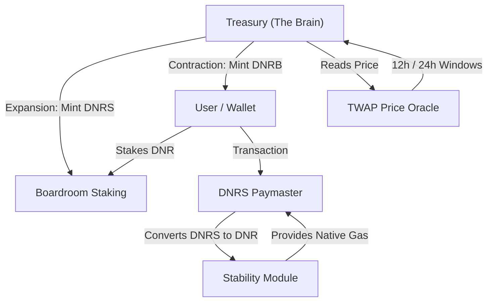

# Kortana DNRS — 100% Algorithmic Stablecoin System


**Kortana Dinar Stable (DNRS)** is a decentralized, 100% algorithmic stablecoin system built on the **Kortana Blockchain**. Inspired by the Neo-Seigniorage model, DNRS is designed to maintain a 1:1 peg with the US Dollar WITHOUT the need for over-collateralized assets. 

The system leverages a unique triple-token architecture (DNRS, DNRB) and advanced circuit breakers to ensure long-term stability and protocol health.

---

## 🏗 System Architecture

The DNRS ecosystem consists of several interconnected smart contracts that manage the peg through expansion and contraction epochs.



---

## 💎 Core Components

### 1. DNRS Token (`DNRSToken.sol`)
*   **Role**: The primary stablecoin.
*   **Mechanism**: Elastic supply driven by the Treasury.
*   **Protection**: Implements a **Transfer Tax** (up to 2%) during heavy contraction phases to discourage panic dumping.

### 2. DNR Bond (`DNRBond.sol`)
*   **Role**: The stability asset used to contract supply.
*   **Mechanism**: When DNRS is below $1.00, users can burn DNRS to receive DNRB at a discount. Bonds can be redeemed for 1.1x DNRS when the price recovers.
*   **Redemption**: Uses a **FIFO (First-In-First-Out)** lotting system to ensure orderly recovery.

### 3. Treasury (`Treasury.sol`)
*   **Role**: The "Governor" of the protocol.
*   **Logic**:
    *   **IF Price > $1.01**: Expand supply by minting DNRS for stakers.
    *   **IF Price < $1.00**: Issue bonds to lock/burn DNRS.
    *   **IF Price < $0.80**: **EMERGENCY HALT** (Death Spiral Circuit Breaker).

### 4. Boardroom Staking (`BoardroomStaking.sol`)
*   **Role**: Rewards the DAO and DNR holders.
*   **Mechanism**: DNR stakers receive the majority of seigniorage (newly minted DNRS) during expansion epochs. Includes a **6-epoch withdrawal lockup**.

### 5. Account Abstraction & Paymaster (`DNRSPaymaster.sol`)
*   **Innovation**: Part of the **BelloMundo** and **MyHealthFriend** ecosystem.
*   **Feature**: Allows users to pay ALL gas fees on the Kortana blockchain using DNRS. No native DNR is required in the user's wallet.

---

## 🚀 Testnet Deployment Alpha

| Contract | Address (Kortana Testnet) |
| :--- | :--- |
| **PriceOracle** | `0x1f04552a511357FA0BaeA12115D6f2E6E15C027E` |
| **DNRSToken** | `0xa1E9679c7AE524a09AbE34464A99d8D5daaEA92B` |
| **DNRBond** | `0x48Bb567c21773774aBe35DD1A0815FBB8446eB14` |
| **BoardroomStaking**| `0x216E22FbBC3f891B38434bC92F3512B55Fd02C3f` |
| **Treasury** | `0x22769e2f36Aa95B5F111484030b7D3b8eF6C2F8b` |
| **DNRSPaymaster** | `0xb73548Fa9F311523D461Fb745aFBD57259E44790` |

---

## 📈 Economic Cycles

### Expansion Phase (Peg > $1.01)
1. Treasury detects expansion.
2. New DNRS tokens are minted.
3. 80% go to Boardroom stakers, 18% to the Stability Module (for Paymaster), and 2% to the Dev fund.

### Contraction Phase (Peg < $1.00)
1. Treasury enables Bond purchasing.
2. Users swap DNRS for DNRB (Stablecoin is burned).
3. The supply decreases until the peg is restored.

---

## 🛠 Developer Guide

### Prerequisites
*   Node.js v18+
*   Hardhat
*   A wallet with Kortana Testnet DNR

### Setup & Compilation
```bash
git clone https://github.com/kortanablockchain/kortana-dnrs.git
cd kortana-dnrs
npm install
npx hardhat compile
```

### Deployment Sequence
See the `scripts/` directory for the ordered deployment flow:
1. `01-deploy-oracle.js`
2. `02-deploy-dnrs-token.js`
3. ...
10. `09-fund-paymaster.js`

### Running Simulations
Run the deep simulations to test circuit breakers:
```bash
npx hardhat test test/DeathSpiralSimulation.test.js
```

---

## 🛡 Security First
*   **Anti-Manipulation**: Includes TWAP windows to prevent flash-loan oracle attacks.
*   **Block Limits**: Hard-capped minting amounts per block to prevent hyper-inflationary exploits.
*   **Governance**: Guardian roles can trigger pauses during suspicious activity.

---

## 🌐 Vision
DNRS is not just a stablecoin; it is the financial backbone for the **Kortana Ecosystem**. By enabling gasless transactions and a stable unit of account, it paves the way for the **MyHealthFriend** telemedicine platform and the broader **BelloMundo** vision of accessible blockchain services.

**Powered by Kortana Blockchain** | *Neo-Seigniorage for the Neo-World*
