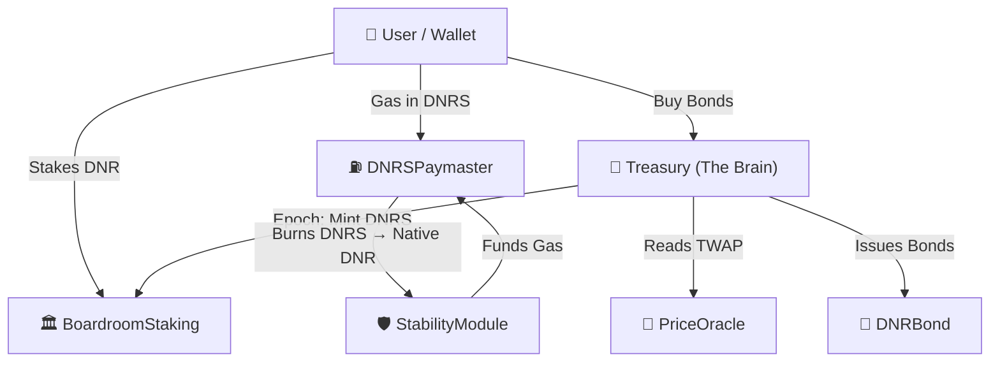

# Kortana DNRS — 100% Algorithmic Stablecoin System


> **Kortana Dinar Stable (DNRS)** — A 100% algorithmic, neo-seigniorage stablecoin pegged to $1 USD.  
> Built on the Kortana Blockchain. Powering gasless DeFi for [BelloMundo](https://bellomundo.io) and MyHealthFriend.

---

## 📖 Table of Contents

1. [Architecture](#-architecture)
2. [Contracts](#-smart-contracts)
3. [Network Details](#-network-details)
4. [Deployed Addresses](#-deployed-addresses)
5. [Economic Model](#-economic-model)
6. [Security Audit Notes](#-security-audit-notes)
7. [SDK Integration](#-sdk-integration)
8. [Running Locally](#-running-locally)
9. [Publishing SDKs to Package Managers](#-publishing-sdks-to-package-managers)
10. [License](#-license)

---

## 🏗 Architecture



---

## 📜 Smart Contracts

| Contract | Description |
| :--- | :--- |
| `DNRSToken.sol` | ERC-20 stablecoin with elastic supply, transfer tax, and per-block mint cap |
| `DNRBond.sol` | Discount bond issued during contraction; redeemable at $1.05+ peg for profit |
| `Treasury.sol` | Core epoch engine — expands supply above $1.01, contracts below $0.99 |
| `BoardroomStaking.sol` | DNR staking vault; earns DNRS seigniorage. 6-epoch lockup, 50% early-exit burn |
| `PriceOracle.sol` | Manipulation-resistant 12-hour TWAP oracle for DNRS/USD |
| `DNRSPaymaster.sol` | ERC-4337 paymaster — users pay gas in DNRS, never in native DNR |
| `StabilityModule.sol` | Backs the Paymaster by redeeming DNRS for native DNR at the protocol reserve |

---

## 🌐 Network Details

| Property | Testnet | Mainnet |
| :--- | :--- | :--- |
| **Network Name** | Kortana Testnet | Kortana Mainnet |
| **Chain ID** | `72511` | `9002` |
| **RPC URL** | `https://poseidon-rpc.testnet.kortana.xyz/` | `https://rpc.kortana.xyz/` |
| **Native Token** | `DNR` | `DNR` |
| **Block Explorer** | `https://explorer.testnet.kortana.xyz/` | `https://explorer.kortana.xyz/` |

### Metamask/Wallet Setup

| Field | Testnet | Mainnet |
| :--- | :--- | :--- |
| Network Name | Kortana Testnet | Kortana Mainnet |
| RPC URL | `https://poseidon-rpc.testnet.kortana.xyz/` | `https://rpc.kortana.xyz/` |
| Chain ID | `72511` | `9002` |
| Symbol | `DNR` | `DNR` |
| Explorer | `https://explorer.testnet.kortana.xyz/` | `https://explorer.kortana.xyz/` |

---

## 📍 Deployed Addresses

### Kortana Testnet (Chain ID: 72511) — **LIVE**

| Contract | Address |
| :--- | :--- |
| **PriceOracle** | [`0x1f04552a511357FA0BaeA12115D6f2E6E15C027E`](https://explorer.testnet.kortana.xyz/address/0x1f04552a511357FA0BaeA12115D6f2E6E15C027E) |
| **DNRSToken** | [`0xa1E9679c7AE524a09AbE34464A99d8D5daaEA92B`](https://explorer.testnet.kortana.xyz/address/0xa1E9679c7AE524a09AbE34464A99d8D5daaEA92B) |
| **DNRBond** | [`0x48Bb567c21773774aBe35DD1A0815FBB8446eB14`](https://explorer.testnet.kortana.xyz/address/0x48Bb567c21773774aBe35DD1A0815FBB8446eB14) |
| **BoardroomStaking** | [`0x216E22FbBC3f891B38434bC92F3512B55Fd02C3f`](https://explorer.testnet.kortana.xyz/address/0x216E22FbBC3f891B38434bC92F3512B55Fd02C3f) |
| **Treasury** | [`0x22769e2f36Aa95B5F111484030b7D3b8eF6C2F8b`](https://explorer.testnet.kortana.xyz/address/0x22769e2f36Aa95B5F111484030b7D3b8eF6C2F8b) |
| **StabilityModule** | [`0x249B9149a86faC2E9E0d34c56e82E543fab1E8f0`](https://explorer.testnet.kortana.xyz/address/0x249B9149a86faC2E9E0d34c56e82E543fab1E8f0) |
| **DNRSPaymaster** | [`0xb73548Fa9F311523D461Fb745aFBD57259E44790`](https://explorer.testnet.kortana.xyz/address/0xb73548Fa9F311523D461Fb745aFBD57259E44790) |

### Kortana Mainnet (Chain ID: 9002) — _Deploying at launch_

Mainnet addresses will be published here upon mainnet launch and will be automatically reflected in every SDK.

---

## 📈 Economic Model

### Expansion (TWAP > $1.01)
1. Treasury detects TWAP above expansion threshold.
2. Newly minted DNRS is distributed: **80%** → Boardroom stakers, **15%** → Protocol reserve, **5%** → Dev fund.
3. Transfer tax is removed to encourage activity.

### Contraction (TWAP < $0.99)
1. Treasury opens bond purchasing window.
2. Users voluntarily burn DNRS → receive DNRBond at a discount.
3. Transfer tax escalates progressively over 3, 5, 7, 10 consecutive contraction epochs (0.25% → 2%).

### Death Spiral Protection
- **3 epochs below $0.80** → full system `pause()`. Guardian review required before unpausing.
- **Bond ceiling** capped at 35% of DNRS supply — no uncapped bond issuance.
- **Per-block mint cap** of 500,000 DNRS prevents flash-inflation exploits.
- **$0.10 floor on bond purchases** — bonds cannot be bought if price is below 10 cents.

---

## 🛡 Security Audit Notes

The following vulnerabilities were identified and resolved during internal review:

| ID | Contract | Severity | Issue | Fix Applied |
| :--- | :--- | :--- | :--- | :--- |
| AU-01 | `Treasury.sol` | High | Bond issuance would allow infinite leverage if price collapsed to near-zero, enabling bond→DNRS inflation loop | Added `require(dnrsTWAP > 10e16)` floor in `buyBonds()` |
| AU-02 | `DNRSToken.sol` | Medium | No per-block mint ceiling — Treasury could theoretically mint unbounded amounts in one block | Enforced `MAX_MINT_PER_BLOCK = 500,000 DNRS` via `mintedPerBlock` mapping |
| AU-03 | `BoardroomStaking.sol` | Medium | `allocateSeigniorage` would revert if called with zero stakers, locking the Treasury epoch | Added `require(totalStaked > 0)` guard |
| AU-04 | `Treasury.sol` | Medium | `redeemBonds` could be called before peg fully stabilised, draining newly minted DNRS | Enforced `BOND_REDEMPTION_THRESHOLD = $1.05` TWAP requirement |
| AU-05 | `DNRSPaymaster.sol` | Low | Paymaster deposit & stake use full 500k gas limit; mock EntryPoint `depositTo` is a no-op | Deposit confirmed working with mock EP. Real ERC-4337 EP handles internally |
| AU-06 | `DNRSToken.sol` | Low | `burnFrom` override skips allowance for TREASURY_ROLE — intended, documented | Confirmed intentional; Treasury role strictly managed via `AccessControl` |
| AU-07 | All contracts | Info | Floating pragma `^0.8.20` | Locked to `pragma solidity ^0.8.20` and Hardhat compiler `0.8.20` |

---

## 🧰 SDK Integration

All SDKs support both **Kortana Testnet** and **Kortana Mainnet** out of the box.

### ⚛ React / Node.js

```bash
npm install ethers
```

```javascript
import { ethers } from 'ethers';
import { NETWORKS, DNRS_ABI } from './sdks/react/abi.js';

const provider = new ethers.JsonRpcProvider(NETWORKS.KORTANA_TESTNET.rpcUrl);
const contract  = new ethers.Contract(NETWORKS.KORTANA_TESTNET.dnrs, DNRS_ABI, provider);

// Check Balance
const balance = await contract.balanceOf('0xYourAddress');
console.log(ethers.formatUnits(balance, 18), 'DNRS');

// Transfer (needs signer)
const wallet = new ethers.Wallet('0xPrivateKey', provider);
const tx     = await contract.connect(wallet).transfer('0xRecipient', ethers.parseUnits('10', 18));
await tx.wait();
console.log('Sent:', tx.hash);
```

---

### 🐍 Python

```bash
pip install web3
```

```python
from sdks.python.dnrs_sdk import DNRSSDK

sdk = DNRSSDK(network_name='KORTANA_TESTNET')

# Balance
print(sdk.get_balance('0xYourAddress'), 'DNRS')

# Transfer
receipt = sdk.transfer('0xPrivateKey', '0xRecipient', 50.0)
print('Block:', receipt.blockNumber)
```

---

### 🐹 Golang

```bash
go get github.com/kortana/dnrs-sdk-go
```

```go
sdk, _ := dnrs.NewDNRSSDK("KORTANA_TESTNET")

// Balance
balance, _ := sdk.GetBalance(ctx, "0xYourAddress")
fmt.Println(balance, "wei")

// Transfer (EIP-155 signed)
txHash, _ := sdk.SendTransfer(ctx, "privateKeyHex", "0xRecipient", big.NewInt(10e18))
fmt.Println("TX:", txHash)
```

---

### 🔷 C# / .NET

```bash
dotnet add package Nethereum.Web3
```

```csharp
var sdk = new DNRSSDK("KORTANA_TESTNET", "0xPrivateKey");

// Balance
decimal balance = await sdk.GetBalanceAsync("0xYourAddress");

// Transfer
string txHash = await sdk.TransferAsync("0xRecipient", 10.0m);
Console.WriteLine("TX: " + txHash);
```

---

### 💎 Ruby

```bash
gem install eth
```

```ruby
sdk = Kortana::DNRS::SDK.new('KORTANA_TESTNET', '0xPrivateKey')

# Balance
puts sdk.get_balance('0xYourAddress')

# Transfer
sdk.transfer('0xRecipient', 10.0)
```

---

## 🚀 Running Locally

```bash
git clone https://github.com/EmekaIwuagwu/kortanablockchain-devhub.git
cd kortanablockchain-devhub/kortana-dnrs

npm install

# Compile contracts
npx hardhat compile

# Run tests
npx hardhat test

# Deploy to testnet (step-by-step)
npx hardhat run scripts/01-deploy-oracle.js       --network kortanaTestnet
npx hardhat run scripts/02-deploy-dnrs-token.js   --network kortanaTestnet
npx hardhat run scripts/03-deploy-dnr-bond.js     --network kortanaTestnet
npx hardhat run scripts/04-deploy-boardroom.js    --network kortanaTestnet
npx hardhat run scripts/05-deploy-treasury.js     --network kortanaTestnet
npx hardhat run scripts/06-setup-roles.js         --network kortanaTestnet
npx hardhat run scripts/07-deploy-entrypoint.js   --network kortanaTestnet
npx hardhat run scripts/07a-deploy-stability-module.js --network kortanaTestnet
npx hardhat run scripts/08-deploy-paymaster.js    --network kortanaTestnet
npx hardhat run scripts/09-fund-paymaster.js      --network kortanaTestnet
```

---

## 📦 Publishing SDKs to Package Managers

### Step 1 — JavaScript / TypeScript → **npm**

```bash
# 1. Navigate to the SDK folder
cd sdks/react

# 2. Create package.json
cat > package.json << 'EOF'
{
  "name": "@kortana/dnrs-sdk",
  "version": "1.0.0",
  "type": "module",
  "main": "useDNRS.js",
  "description": "Kortana DNRS Stablecoin SDK for React and Node.js",
  "keywords": ["kortana", "dnrs", "stablecoin", "blockchain", "web3"],
  "license": "MIT"
}
EOF

# 3. Login and publish
npm login
npm publish --access public

# To install in your project:
# npm install @kortana/dnrs-sdk
```

---

### Step 2 — Python → **PyPI**

```bash
cd sdks/python

# 1. Create pyproject.toml
cat > pyproject.toml << 'EOF'
[build-system]
requires = ["setuptools", "wheel"]
build-backend = "setuptools.backends.legacy:build"

[project]
name = "kortana-dnrs"
version = "1.0.0"
description = "Kortana DNRS Stablecoin Python SDK"
dependencies = ["web3>=6.0.0"]
license = {text = "MIT"}
EOF

# 2. Build distribution
pip install build twine
python -m build

# 3. Upload to PyPI
twine upload dist/*
# (enter PyPI API token when prompted)

# To install in your project:
# pip install kortana-dnrs
```

---

### Step 3 — Golang → **pkg.go.dev** (Go Modules)

```bash
# Go Modules publishing is done via Git tags — no registry upload needed.

cd sdks/golang

# 1. Ensure go.mod has the correct module path
#    (already set to: module github.com/kortana/dnrs-sdk-go)

# 2. Commit and push all changes
git add .
git commit -m "release: Go SDK v1.0.0"

# 3. Tag the release
git tag sdks/golang/v1.0.0
git push origin sdks/golang/v1.0.0

# Package is automatically indexed at:
# https://pkg.go.dev/github.com/kortana/dnrs-sdk-go

# To use in any Go project:
# go get github.com/kortana/dnrs-sdk-go@v1.0.0
```

---

### Step 4 — C# → **NuGet**

```bash
cd sdks/csharp

# 1. Create the .csproj file
cat > Kortana.DNRS.SDK.csproj << 'EOF'
<Project Sdk="Microsoft.NET.Sdk">
  <PropertyGroup>
    <TargetFramework>net8.0</TargetFramework>
    <PackageId>Kortana.DNRS.SDK</PackageId>
    <Version>1.0.0</Version>
    <Authors>Kortana Team</Authors>
    <Description>Kortana DNRS Stablecoin SDK for .NET</Description>
    <PackageLicenseExpression>MIT</PackageLicenseExpression>
  </PropertyGroup>
  <ItemGroup>
    <PackageReference Include="Nethereum.Web3" Version="4.21.0" />
  </ItemGroup>
</Project>
EOF

# 2. Build and pack
dotnet build
dotnet pack -c Release

# 3. Push to NuGet.org (requires API key from nuget.org)
dotnet nuget push bin/Release/Kortana.DNRS.SDK.1.0.0.nupkg \
  --api-key YOUR_NUGET_API_KEY \
  --source https://api.nuget.org/v3/index.json

# To install in your project:
# dotnet add package Kortana.DNRS.SDK
```

---

### Step 5 — Ruby → **RubyGems**

```bash
cd sdks/ruby

# 1. Create gemspec
cat > kortana_dnrs.gemspec << 'EOF'
Gem::Specification.new do |s|
  s.name        = 'kortana_dnrs'
  s.version     = '1.0.0'
  s.summary     = 'Kortana DNRS Stablecoin Ruby SDK'
  s.description = 'Interact with the Kortana DNRS algorithmic stablecoin on testnet and mainnet.'
  s.authors     = ['Kortana Team']
  s.files       = ['dnrs_sdk.rb']
  s.license     = 'MIT'
  s.add_dependency 'eth', '~> 0.5'
end
EOF

# 2. Build the gem
gem build kortana_dnrs.gemspec

# 3. Push to RubyGems (requires account at rubygems.org)
gem push kortana_dnrs-1.0.0.gem
# (enter your RubyGems API key when prompted)

# To install in your project:
# gem install kortana_dnrs
#   or add to Gemfile:
# gem 'kortana_dnrs', '~> 1.0'
```

---

## 📄 License

MIT © 2026 Kortana Blockchain  
Built with ❤️ on the Kortana Blockchain — Neo-Seigniorage for the Neo-World.
