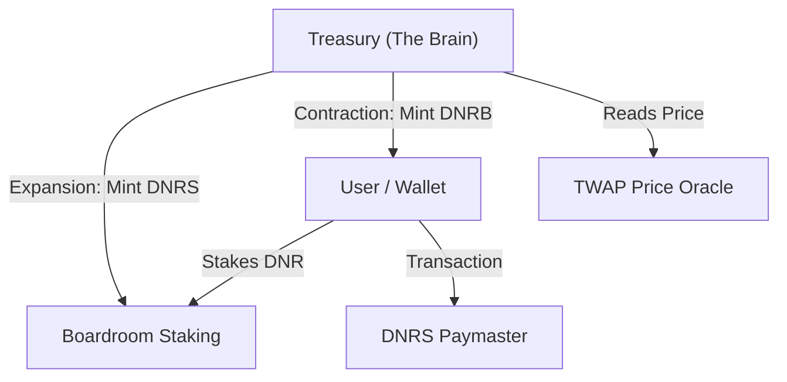

# Kortana DNRS — 100% Algorithmic Stablecoin System

**Kortana Dinar Stable (DNRS)** is a decentralized, 100% algorithmic stablecoin system built on the **Kortana Blockchain**. Inspired by the Neo-Seigniorage model, DNRS is designed to maintain a 1:1 peg with the US Dollar WITHOUT the need for over-collateralized assets. 

---

## 🏗 System Architecture

---

## 💎 Testnet Addresses (Alpha)

| Contract | Address (Kortana Testnet) |
| :--- | :--- |
| **PriceOracle** | `0x1f04552a511357FA0BaeA12115D6f2E6E15C027E` |
| **DNRSToken** | `0xa1E9679c7AE524a09AbE34464A99d8D5daaEA92B` |
| **DNRBond** | `0x48Bb567c21773774aBe35DD1A0815FBB8446eB14` |
| **BoardroomStaking**| `0x216E22FbBC3f891B38434bC92F3512B55Fd02C3f` |
| **Treasury** | `0x22769e2f36Aa95B5F111484030b7D3b8eF6C2F8b` |
| **DNRSPaymaster** | `0xb73548Fa9F311523D461Fb745aFBD57259E44790` |
| **StabilityModule** | `0x249B9149a86faC2E9E0d34c56e82E543fab1E8f0` |

---

## 📦 SDK Deployment & Integration

The DNRS ecosystem provides off-the-shelf SDKs for 5 major languages.

### ⚛ React JS (npm)
*   **Install**: `npm install @kortana/dnrs-sdk`
*   **Publish**: `npm publish --access public`
*   **Library**: [sdks/react/](sdks/react/)

### 🐍 Python (pypi)
*   **Install**: `pip install kortana-dnrs`
*   **Publish**: `twine upload dist/*`
*   **Library**: [sdks/python/](sdks/python/)

### 🐹 Golang (go modules)
*   **Install**: `go get github.com/kortana/dnrs-sdk-go`
*   **Publish**: `git tag v1.0.0; git push origin v1.0.0`
*   **Library**: [sdks/golang/](sdks/golang/)

### 🔷 C# (NuGet)
*   **Install**: `dotnet add package Kortana.DNRS.SDK`
*   **Publish**: `dotnet nuget push bin/Release/*.nupkg`
*   **Library**: [sdks/csharp/](sdks/csharp/)

### 💎 Ruby (RubyGems)
*   **Install**: `gem install kortana_dnrs`
*   **Publish**: `gem build kortana_dnrs.gemspec; gem push *.gem`
*   **Library**: [sdks/ruby/](sdks/ruby/)

---

## 🛠 Usage Examples (Transfers & Balances)

Every SDK follows a unified pattern:
1.  **Initialize** with a Kortana RPC URL.
2.  **Get Balance** using `getBalance()`.
3.  **Transfer** using `transfer()` (requires a private key).

For full language-specific code snippets, view the **[EXAMPLES.md](sdks/EXAMPLES.md)** file.

---

## 🛡 Security & Safety
*   **Death Spiral Circuit Breaker**: Treasury halts if peg below $0.80 for 3 epochs.
*   **TWAP Oracle**: Prevents oracle manipulation via 12-hour TWAP windows.
*   **Account Abstraction**: Native Paymaster support for gasless user experiences.

**Powered by Kortana Blockchain** | *Neo-Seigniorage for the Neo-World*
